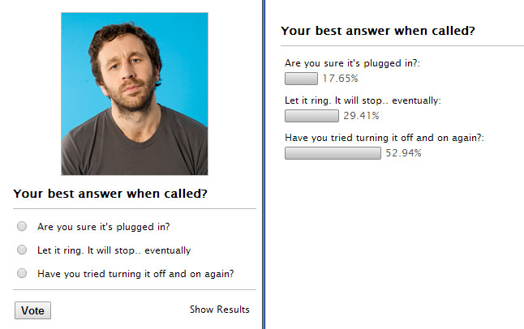

.. ==================================================
.. FOR YOUR INFORMATION
.. --------------------------------------------------
.. -*- coding: utf-8 -*- with BOM.

.. include:: ../Includes.txt

What does it do?
================

With the release of TYPO3 6.2 we saw the need of a clean and simple poll extension.

There are others like myquizpoll but they are mostly overloaded with features and therefore not easy to use and maintain for editors.

Our goal was to keep it as simple as possible

Contributors
-------------
Alex Bigott - Initial and maintaining development of extension.

Bernhard Berger - Move TCA from ext_tables.php to Configuration/TCA and cleanup.

Main Features
-------------

- easy to setup
- easy to use
- protection against multiple votes via cookies or IP address
- ajax calls for all actions - no page reload
- easy to cusomize using TypoScript and Fluid templates.

	**Left:** Standard View for the SimplePoll (with optional image).
	**Right:** Standard View after voting or if the SimplePoll has ended and only the results are displayed.