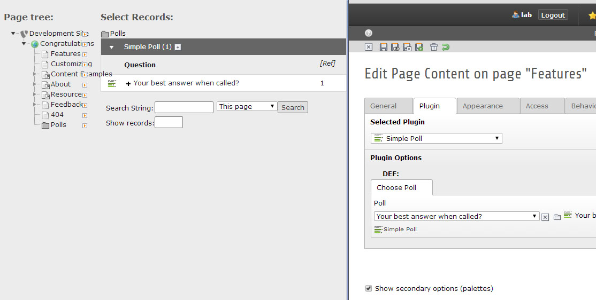

.. ==================================================
.. FOR YOUR INFORMATION
.. --------------------------------------------------
.. -*- coding: utf-8 -*- with BOM.

.. include:: ../Includes.txt

.. _editors-manual:

Editors manual
==============

.. important::
	It may be that not all options visible here in this documentation are also visible to every editor.

	The administrator may still choose to hide several options from an editor.

.. note::
	Make sure the SimplePoll extension was installed and setup correctly. If you need to know how, check here: :ref:`admin-manual`

Creating a new Simplepoll
-------------------------

- You start by selecting the page or folder where you want to have the SimplePoll in list mode. (``Polls`` in the image below)
- Create a new record
- Under **Simple Poll** select **Simple Poll**

.. figure:: ../Images/EditorsManual/EditorsManual_newPoll.jpg
	:width: 500px

The clean SimplePoll
^^^^^^^^^^^^^^^^^^^^

To get the SimplePoll rolling you basically only need to enter the question and the answers. That is enough.

.. figure:: ../Images/EditorsManual/EditorsManual_newPollClean.jpg
	:width: 500px
	:alt: Clean new SimplePoll

	The newly created SimplePoll (if you are allowed to view all settings).

Settings and Values
^^^^^^^^^^^^^^^^^^^

Question
	The question for the SimplePoll.
|
Image
	An optional image.
|

End Time 
	The time when the SimplePoll should end. After this date no more votes are allowed and only the results are displayed.
        If you see no poll in frontend, check if the End Time is set to a future Date.
|
Show Result Link
	Option if the link to the results page should be displayed.
|
Show Result After Vote
	Option if after submitting a vote the results should be displayed.
|
Allow Multiple Vote
	Option if a user is allowed to vote multiple times. Check the :ref:`admin-manual` to see how to use IP or cookie blocking and how to setup the timer for this option.
|
Answers
	Create as many answers as you like.
	The counter in the answers lets you see how many times this answer has been voted for (if you are allowed to see it). (Ask the german public television on how to "tune" these.)
|
IP Locks
	Again, if you are allowed to see them, these are the IP locks stating the IP addresses and the time they voted

Display the SimplePoll in the Frontend
^^^^^^^^^^^^^^^^^^^^^^^^^^^^^^^^^^^^^^

- Create a new Content Element **Plugins -> General Plugin**
- Under the Tab **Plugin** select **Simple Poll** in the Selected Plugin select menu.
- Under Choose Poll click on the **Browse for Records** icon.
- In the new window that opens select the folder or page on the left in which your SimplePolls are stored.
- On the right side select the SimplePoll you want to use.
- Save the Content Element.

	Choose a SimplePoll to use and save the Content Element and you are good to go.

